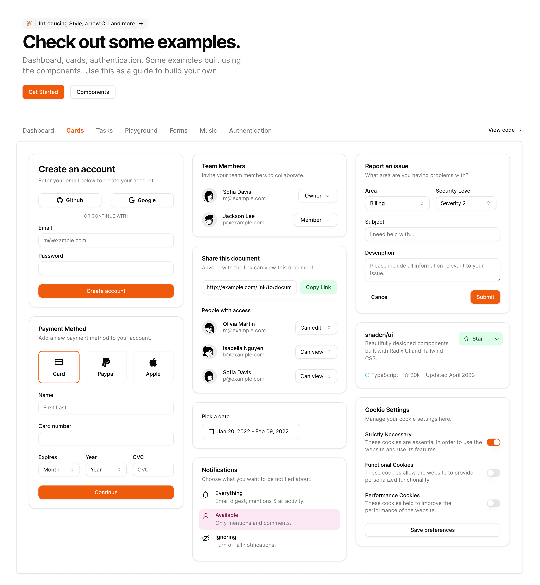

# shadcn-custom-theme

This tool generate a custom theme similar to the ones created by the [shadcn/ui Themes website](https://ui.shadcn.com/themes).

You can specify the primary, secondary, accent, and gray colors. The color name should be one
of the default Tailwind color names (e.g. red, green, blue, indigo, etc.) The `primary` color is
required, the rest defaults to Tailwind `gray`.

## Usage

`npx shadcn-custom-theme primary=COLOR [secondary=COLOR] [accent=COLOR] [gray=color] [template=TEMPLATE.json]`

This will output the CSS variables that you can paste into your `global.css`.

You can also specify a `TEMPLATE.json` file which has the default colors. [See below for example](#templatejson).

For example

```bash
npx shadcn-custom-theme primary=orange secondary=green accent=pink gray=neutral
```

Will output the following:

```css
@layer base {
  :root {
    --background: 0 0% 100% /* white */;
    --foreground: 0 0% 4% /* neutral-950 */;
    --card: 0 0% 100% /* white */;
    --card-foreground: 0 0% 4% /* neutral-950 */;
    --popover: 0 0% 100% /* white */;
    --popover-foreground: 0 0% 4% /* neutral-950 */;
    --primary: 21 91% 49% /* orange-600 */;
    --primary-foreground: 34 100% 97% /* orange-50 */;
    --secondary: 141 85% 93% /* green-100 */;
    --secondary-foreground: 144 62% 21% /* green-900 */;
    --muted: 0 0% 97% /* neutral-100 */;
    --muted-foreground: 0 0% 46% /* neutral-500 */;
    --accent: 326 78% 95% /* pink-100 */;
    --accent-foreground: 336 70% 31% /* pink-900 */;
    --destructive: 0 85% 61% /* red-500 */;
    --destructive-foreground: 0 0% 99% /* neutral-50 */;
    --border: 0 0% 90% /* neutral-200 */;
    --input: 0 0% 90% /* neutral-200 */;
    --ring: 21 91% 49% /* orange-600 */;
    --radius: 0.75rem;
  }

  .dark {
    --background: 0 0% 4% /* neutral-950 */;
    --foreground: 0 0% 99% /* neutral-50 */;
    --card: 0 0% 4% /* neutral-950 */;
    --card-foreground: 0 0% 99% /* neutral-50 */;
    --popover: 0 0% 4% /* neutral-950 */;
    --popover-foreground: 0 0% 99% /* neutral-50 */;
    --primary: 21 91% 49% /* orange-600 */;
    --primary-foreground: 34 100% 97% /* orange-50 */;
    --secondary: 143 65% 25% /* green-800 */;
    --secondary-foreground: 139 77% 97% /* green-50 */;
    --muted: 0 0% 15% /* neutral-800 */;
    --muted-foreground: 0 0% 64% /* neutral-400 */;
    --accent: 336 75% 36% /* pink-800 */;
    --accent-foreground: 328 74% 98% /* pink-50 */;
    --destructive: 0 63% 31% /* red-900 */;
    --destructive-foreground: 0 0% 99% /* neutral-50 */;
    --border: 0 0% 15% /* neutral-800 */;
    --input: 0 0% 15% /* neutral-800 */;
    --ring: 21 91% 49% /* orange-600 */;
  }
}
```




## TEMPLATE.json

This has the colors/tints for each CSS variable.

> NOTE: colors prefixed with `primary`, `secondary`, `accent`, and `gray` will
> be replaced with the color value specified as CLI arguments. All other colors
> will be used directly, like `red-500`.

The following is the default theme template. You can override this by specifying
the `template=TEMPLATE.json` file.

```json
{
  "light": {
    "--background": "white",
    "--foreground": "gray-950",
    "--card": "white",
    "--card-foreground": "gray-950",
    "--popover": "white",
    "--popover-foreground": "gray-950",
    "--primary": "primary-600",
    "--primary-foreground": "primary-50",
    "--secondary": "secondary-100",
    "--secondary-foreground": "secondary-900",
    "--muted": "gray-100",
    "--muted-foreground": "gray-500",
    "--accent": "accent-100",
    "--accent-foreground": "accent-900",
    "--destructive": "red-500",
    "--destructive-foreground": "gray-50",
    "--border": "gray-200",
    "--input": "gray-200",
    "--ring": "primary-600",
    "--radius": "0.5rem"
  },
  "dark": {
    "--background": "gray-950",
    "--foreground": "gray-50",
    "--card": "gray-950",
    "--card-foreground": "gray-50",
    "--popover": "gray-950",
    "--popover-foreground": "gray-50",
    "--primary": "primary-600",
    "--primary-foreground": "primary-50",
    "--secondary": "secondary-800",
    "--secondary-foreground": "secondary-50",
    "--muted": "gray-800",
    "--muted-foreground": "gray-400",
    "--accent": "accent-800",
    "--accent-foreground": "accent-50",
    "--destructive": "red-900",
    "--destructive-foreground": "gray-50",
    "--border": "gray-800",
    "--input": "gray-800",
    "--ring": "primary-600"
  }
}
```
